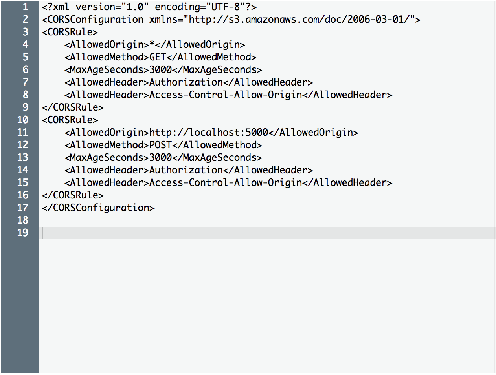

# Ellie

## Development

### Requirements
- [Python 3](https://www.python.org/downloads/)
- [Node.js LTS](https://nodejs.org/en/download/)
- [Elm 0.18.0](https://guide.elm-lang.org/install.html)

### Setup
1. Copy `.env.example` to `.env`, filling in the following required variables:
  - `AWS_S3_BUCKET`: an S3 bucket to which you want to save revisions
  - `AWS_ACCESS_KEY_ID`: an access key id for an AWS user that has write access to your S3 bucket
  - `AWS_SECRET_ACCESS_KEY`: a secret access key for an AWS user that has write access to your S3 bucket

  > I don't recommend that you change the CDN_BASE variable right now, it's needed for loading the compiler web worker and installing packages

1. Choose your favorite way to load `.env` files
  - I have a shell function that does it:
```
function dotenv () {
  env $(cat .env | xargs) $*
}
```
  - There are various `dotenv` programs written in different languages that you can try

1. Give `http://localhost:5000` write access to your S3 bucket


1. Set up a virtual python environment and load it.
  ```
  python3 -m venv ./env && . env/bin/activate
  ```

1. Install Python dependencies
  ```
  pip install -r requirements.txt
  ```

1. Install frontend dependencies
  ```
  npm install
  ```

1. Run the server
  ```
  dotenv flask run
  ```

1. Run the client development server
  ```
  dotenv npm run watch
  ```

1. Open `http://localhost:5000`
